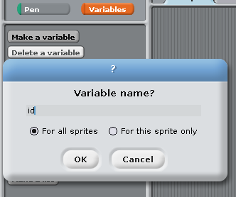
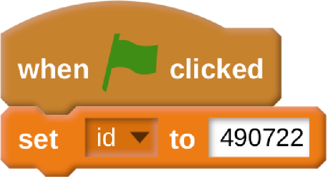
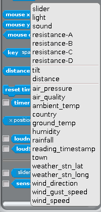

# The Scratch Weather Dashboard

In this resource, you will be creating a basic weather dashboard to monitor Weather Stations all over the world.

## Fetching the interface.py file

For Scratch to be able to talk to Weather Stations, it needs a little help. There's a complicated Python script you can run that will help Scratch communicate with them.

1. Open a terminal by pressing the `Ctrl`, `Alt` and `T` keys at the same time, or by clicking on the icon in the left-hand corner of the screen.

1. Type the following command into the terminal to get the Python file:

	```bash
	 wget -O interface.py rpf.io/wsd 
	```
	
1. That's it: you've downloaded the file. Keep the terminal open though, as you'll need it in a minute.

## Setting up Scratch

Now we need to help Scratch talk to the file you've downloaded.

1. Open Scratch by clicking on `Menu` > `Programming` > `Scratch`.

1. Once Scratch opens, you need to enable `remote sensors`. Click on the `sensing` button to reveal the `sensing blocks`:

	

1. Now find the block called `slider sensor value` and right-click on it. Click on `enable remote sensor connections`:


## Starting your Python script

1. Now that Scratch can talk to Python, you need to start the Python script so that it can fetch lots of Weather Station data and send it to Scratch.

1. Go back to the terminal, and type the following:

```bash
python3 interface.py
```

## Getting data from a Weather Station

1. If you have your own Weather Station at your school, ask your teacher for the Weather Station's ID. If you don't have one, then you can use the ID in the code below.

1. The first step is simple. You can make the Scratch cat tell you the weather for any particular Weather Station you like. First, grab a `when green flag clicked` block:

	

1. Then click on `Variables` and then `Make a variable`. Call it `id`:

	

1. Once you've created the variable, you can set it to your Weather Station's ID. You can find a [list of Weather Station IDs here](stations.txt).

	

1. Now if you go back to the `Sensing` menu in Scratch and find the `slider sensor value` block, you should see there's a little black arrow that points downwards, next to the word `slider`. Click this menu and you can change the sensor value to lots of different things:

	

1. To start off with, you can choose `air_pressure`, and then use a `say for 2 secs` block (selected from `Looks`) so that the cat will tell you the air pressure at the Weather Station:

	

1. If nothing happens, go back to the terminal and check the output of the `interfaces.py` script. It might be displaying the message `Station data not found. Please choose another ID`. If this is the case, then choose another ID from the [list of stations](stations.txt).

## Playing around with the sensors

Have a play around with different sensor values to see what they do, and what readings they produce. If you like, you could use `join` blocks to also get the cat to tell you more than one sensor value:


	
## What next?

1. In the [next worksheet](worksheet2.md) you will learn how to produce a graphical dashboard, to show you the weather at your station using images and animations.
