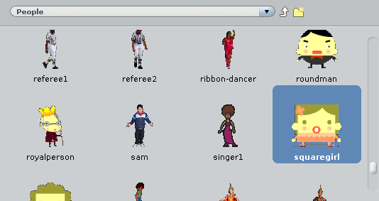
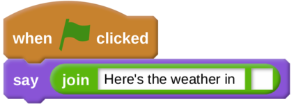
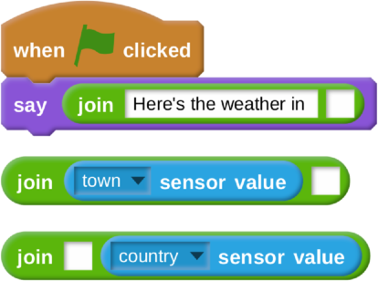
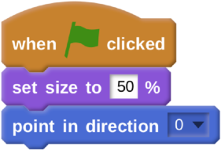
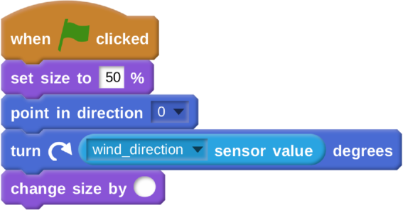
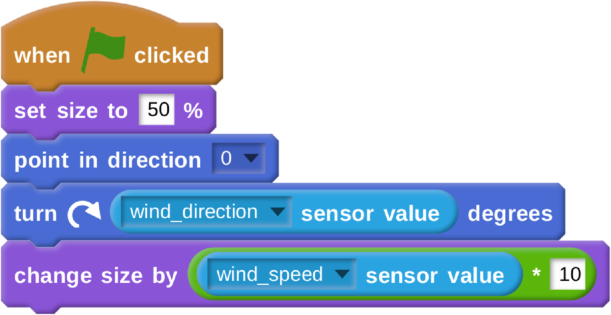
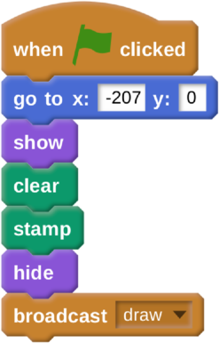

# The Scratch Weather Dashboard

In this next worksheet you will learn how to display some weather data visually; producing a *Weather Dashboard*. You'll want to start a new Scratch file, and enable the remote sensors, just like you did in the first [worksheet](worksheet.md)

## Choosing a forecaster

The first thing you'll want to do is to choose a weather forecaster, who will be telling the viewers what the weather is like. Weather forecasters are often call *meteorologist*.

1. Choose a new sprite, by clicking on the middle button as shown below. 

	

1. Choose any sprite you like. Here we've gone for the `square-girl` image.

## Your forecaster script

1. You can start off, by making your weather forecaster set the `id` of the weather station you will be using.

	

1. She'll then need to say a little bit about where the weather forecast is for. Use a `join` block within a `say` block to begin with, just like you did in [worksheet one](worksheet.md)

	

1. Now grab two more `join` blocks. In the **righthand side** of one, you can place the `town` the weather forecast is coming from. Into the **lefthand side** of the other you can place the `country` that the weather forecast is coming from.

	

1. Now the two `join` blocks can be placed together. It may not be obvious in the image, but you want to add a single *space* character between the two `sensor value`s

	

1. With that done, you can place all three `join` blocks together into the `say` block

	

1. Your forecaster is now finished. Next you can add some graphical elements to help users visualise the weather.

## A Weathervane

1. Next you can make a weathervane. Weathervane's show the direction of the wind, but yours is also going to visualise the speed of the wind.

1. Click on the New sprite button to choose another sprite.

	

1. In `things` you should see a `Clock-hand` which is basically just an arrow. Import this sprite and delete any scripts that come with it.

1. When you weather forecast begins, you'll need to set the size and direction that the arrow points.

	

1. Now, in `Motion` you should see a `turn clockwise __ degrees` block. Add this to the bottom of the script. Then choose the `wind_direction` sensor value, and add this block in.

	

1. To visualise the wind speed, you can change the size of the arrow. Finde the `change size by __` block and add this to your script.

	

1. To finish off, find the `__ * __` block in `Operators` and use it to multiply the `wind_speed` by `10`.

1. This can then be added into the `change size by __` block.

	

## A Thermometer

1. Next you are going to produce a working thermometer. You'll need a graphic to represent it, and the one below should be good enough. Right click on it and download the file to your Raspberry Pi.

	

1. Import this sprite into your Scratch program. You're going to use the pen tool to draw in the mercury inside the thermometer. Becuase you can't draw over the top of Sprites, you can stamp the Sprite's image to the canvas first, and then hide it. This is the only script you'll need on the termometer.

	

1. 
