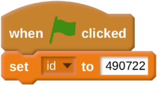

# The Scratch Weather Dashboard

In this next worksheet you will learn how to display some weather data visually; producing a *Weather Dashboard*

## Choosing a forecaster

The first thing you'll want to do is to choose a weather forecaster, who will be telling the viewers what the weather is like. Weather forecasters are often call *meteorologist*.

1. Choose a new sprite, by clicking on the middle button as shown below. 

1. Choose any sprite you like. Here we've gone for the `square-girl` image.

## Your forecaster script

1. You can start off, by making your weather forecaster set the `id` of the weather station you will be using.

1. She'll then need to say a little bit about where the weather forecast is for. Use a `join` block within a `say` block to begin with, just like you did in [worksheet one](worksheet.md)

1. Now grab two more `join` blocks. In the **righthand side** of one, you can place the `town` the weather forecast is coming from. Into the **lefthand side** of the other you can place the `country` that the weather forecast is coming from.

1. Now the two `join` blocks can be placed together. It may not be obvious in the image, but you want to add a single *space* character between the two `sensor value`s

1. With that done, you can place all three `join` blocks together into the `say` block

##
